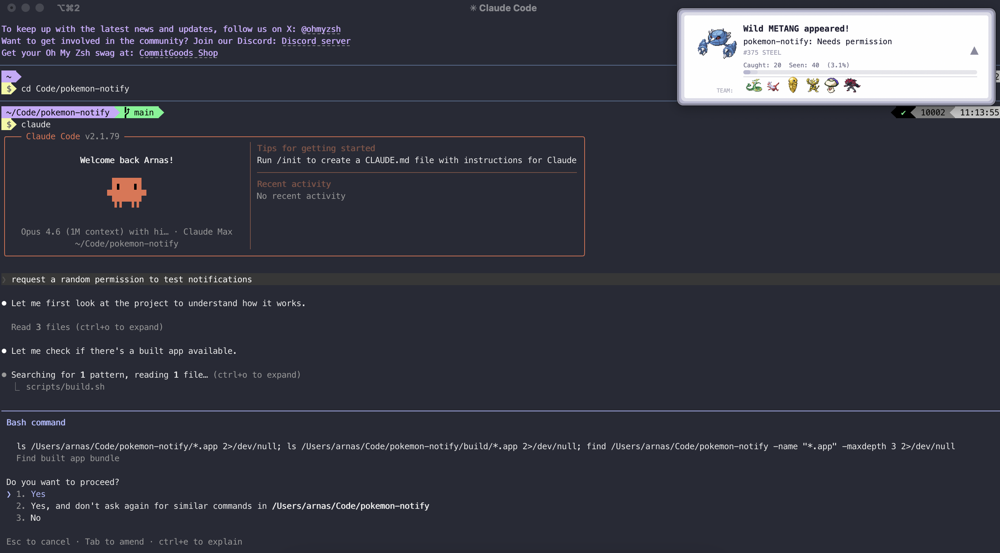

# Pokemon Notify

A Pokemon-themed notification system for macOS, built to replace boring system notifications with a retro Pokemon dialog box experience. Originally built for [Claude Code](https://claude.ai/code) notifications.



## Features

- **Pokemon dialog box** — retro-styled notification with triple border, typewriter text effect, and blinking cursor
- **649 animated Pokemon sprites** — Gen 1-5, randomly appears on each notification
- **Type-colored borders** — fire types get orange borders, water gets blue, ghost gets purple, etc.
- **Time-based spawns** — ghost and dark types appear at night, grass and bug types during the day
- **Shiny Pokemon** — 1/4096 chance (real game odds) to encounter a shiny variant with gold text and sparkle effect
- **Catch mechanic** — click the notification to "catch" the Pokemon and add it to your team
- **Team display** — your last 6 caught Pokemon shown at the bottom
- **Pokedex progress bar** — tracks how many of the 649 Pokemon you've caught and seen
- **Daily encounter counter** — resets each day, Pokedex persists across days
- **Pokeball cursor** — follows your mouse when hovering over the notification

## How it was built

This project was built in a single [Claude Code](https://claude.ai/code) session. What started as wanting better-looking notifications for Claude Code turned into a full Pokemon experience.

The app is a single Swift file (~500 lines) compiled into a macOS `.app` bundle. It uses:
- **AppKit** for the borderless floating window and custom drawing
- **NSBezierPath** for the triple-border Pokemon dialog frame
- **NSImageView** with `.animates = true` for animated GIF sprites
- **Timer** for the typewriter text effect and cursor blinking
- **NSAnimationContext** for slide-in/out animations
- **PokeAPI** sprites (Gen 5 Black/White animated) downloaded at build time

No external dependencies. No Xcode project. Just Swift, a shell script, and some Python for data fetching.

## Requirements

- macOS 13+
- Swift (included with Xcode Command Line Tools)
- Python 3 with Pillow (`pip3 install Pillow`)
- ~60MB disk space (mostly sprites)

## Installation

```bash
# Clone the repo
git clone https://github.com/arnexyz/pokemon-notify.git
cd pokemon-notify

# Build and install (downloads sprites on first run)
./scripts/build.sh
```

The build script:
1. Compiles the Swift source into a macOS app bundle
2. Downloads all 649 Pokemon sprites (normal + shiny) from PokeAPI
3. Downloads Pokemon names and type data
4. Generates the pokeball cursor
5. Code-signs the app
6. Installs to `~/.claude/Pokemon Notify.app`

## Usage

### Standalone

```bash
# Basic notification
"$HOME/.claude/Pokemon Notify.app/Contents/MacOS/claude-notify" "Title" "Message"

# It picks a random Pokemon each time!
"$HOME/.claude/Pokemon Notify.app/Contents/MacOS/claude-notify" "My Project" "Build complete"
```

### With Claude Code

Add this to your `~/.claude/settings.json`:

```json
{
  "hooks": {
    "Notification": [
      {
        "matcher": "permission_prompt",
        "hooks": [
          {
            "type": "command",
            "command": "\"$HOME/.claude/Pokemon Notify.app/Contents/MacOS/claude-notify\" \"$(basename $PWD)\" \"Needs permission\""
          }
        ]
      },
      {
        "matcher": "idle_prompt",
        "hooks": [
          {
            "type": "command",
            "command": "\"$HOME/.claude/Pokemon Notify.app/Contents/MacOS/claude-notify\" \"$(basename $PWD)\" \"Waiting for input\""
          }
        ]
      }
    ]
  }
}
```

Now whenever Claude Code needs your attention, a wild Pokemon will appear!

### Interactions

- **Click** the notification to catch the Pokemon (opens iTerm2 and adds to your team)
- **Ignore** it and the Pokemon flees after 8 seconds (still counted as "seen")
- **Shiny** Pokemon have a ★ marker, gold text, and a sparkle effect (1/4096 odds)

## Stats

Stats are saved to `~/.claude/notify-stats.json` and track:
- Daily encounter count (resets each day)
- Caught vs seen Pokemon (persists forever)
- Your team (last 6 caught)
- Shiny catches
- Pokedex completion percentage

## Project structure

```
pokemon-notify/
├── Sources/
│   └── pokemon-notify.swift    # The entire app (~500 lines)
├── Resources/
│   └── Info.plist              # macOS app bundle config
├── scripts/
│   ├── build.sh                # Build + install script
│   ├── download_data.py        # Fetch Pokemon names/types from PokeAPI
│   ├── download_sprites.sh     # Fetch all 649 sprites (normal + shiny)
│   └── generate_pokeball.py    # Generate pokeball cursor image
├── .gitignore
└── README.md
```

## Credits

- Pokemon sprites from [PokeAPI/sprites](https://github.com/PokeAPI/sprites) (Gen 5 Black/White animated)
- Pokemon data from [PokeAPI](https://pokeapi.co/)
- Built with [Claude Code](https://claude.ai/code)

## License

MIT — see [LICENSE](LICENSE) for the full text.

## Disclaimer

This is a fan project for personal use. Pokemon and all related trademarks are owned by Nintendo, Game Freak, and The Pokemon Company. Sprites are sourced from [PokeAPI/sprites](https://github.com/PokeAPI/sprites). This project is not affiliated with or endorsed by any of these companies.
